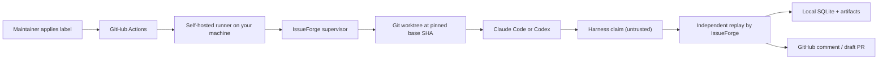

# IssueForge

**A local-first GitHub IssueOps supervisor for the coding agents you already have installed.**

IssueForge watches for a label on a GitHub issue, creates an isolated Git worktree on your machine,
runs Codex or Claude Code non-interactively inside it, **independently verifies the evidence they
produce**, and only then opens a draft pull request.

It is not a new coding agent. It does not replace Codex or Claude Code, and it does not reimplement
their planning or tool-use loop. It supplies the workflow discipline around them.

> GitHub supplies the issue and the event.
> Your machine supplies the agent, the workspace, the credentials and the storage.
> IssueForge supplies the discipline.

**Status: pre-alpha.** Nothing is published yet and there is no working build. The design has been
validated against official documentation and live experiments, but the implementation has not
started. See [Roadmap](#roadmap).

---

## The problem

Triaging a bug repository is the same boring, high-discipline loop every time:

1. Reproduce the bug on a pinned commit.
2. Prove the reproduction is real.
3. Fix it.
4. Prove the fix works in a clean environment.
5. Open a PR for a human to review.

Coding agents can do the *inner* work of each step. What they cannot do is hold themselves to the
outer discipline — and, critically, **they self-report success**. An agent that says "I reproduced
the bug" has produced a *claim*, not evidence.

Today the developer supplies that rigour by hand, and does it inconsistently.

## The thesis

> The scarce thing is not code generation. It is **trustworthy evidence that a claim is true**.

IssueForge never trusts the harness's claim. The agent's result is treated as untrusted input, and
IssueForge independently replays the evidence before any state transition:



The step that matters is `G → V`. Everything else is plumbing around that gate. If an agent claims a
bug is reproduced but the reproduction command actually passes, IssueForge classifies it
`cannot-reproduce` — regardless of what the agent said.

## Why local-first

No IssueForge-hosted backend, queue, dashboard, database or artifact store exists. No issue body,
repository source, agent transcript, patch, test log or run history is uploaded to an IssueForge
service. Beyond privacy, this buys four things:

- **Zero marginal inference cost.** It reuses your existing Codex/Claude subscription, so there is no
  per-run bill and therefore no pressure to monetise your runs.
- **Reuses accumulated context.** Your `CLAUDE.md` / `AGENTS.md`, skills and project instructions
  already encode repository knowledge that a hosted service would have to rebuild.
- **No trust transfer.** Source and transcripts never leave the machine, so adoption needs no vendor
  security review.
- **No operational burden.** No queue, no database, no uptime to run. Install it, remove it.

GitHub remains the collaboration UI. The authoritative run data lives in `~/.issueforge`.

### How the event reaches your laptop

A GitHub Actions workflow triggers on `issues: [labeled]` and routes the job to a **self-hosted
runner** registered on your machine. The runner receives work over an outbound HTTPS long poll, so:

**no polling · no public webhook server · no tunnel · no inbound firewall rule · no cloud service.**

This was chosen over `gh webhook forward`, a GitHub App webhook, and REST polling. It is the only
option that satisfies all of those constraints at once, and it comes with useful properties for free:
a job stays queued for 24 hours if your laptop is asleep, and GitHub supplies run history, logs and a
cancel button.

---

## How it works

### Labels are intent

A maintainer applies an intent label; IssueForge writes back status labels and one concise comment.

| Intent label | Meaning |
| --- | --- |
| `issueforge:reproduce` | Run triage/reproduction only |
| `issueforge:fix` | Allow a confirmed issue to be fixed |
| `issueforge:retry` | Retry the last eligible failed/inconclusive task |
| `issueforge:cancel` | Cancel a live run and clean up |

Status labels — `queued`, `running`, `reproduced`, `cannot-reproduce`, `needs-info`, `fix-pr-open`,
`verification-failed`, `ready-for-review`, `blocked`, `cancelled` — are **outputs only, never
triggers**. Every stage transition is driven by a human applying the next intent label. This is a
deliberate design constraint, not a limitation to be worked around later.

### Who owns what

| Responsibility | Owner |
| --- | --- |
| Issues, labels as intent, event delivery, run history | **GitHub** |
| Event parsing, issue locking, lifecycle state, task cards, **evidence validation**, policy gates, retention | **IssueForge** |
| Repository comprehension, planning, search, tool use, editing, running commands | **The harness** |
| Worktrees, refs, diffs, branches, base-SHA pinning | **Git** |
| Process groups, signals, filesystem, env isolation | **Local OS** |

The boundary is enforced, not merely documented: IssueForge never plans steps, never chooses tools,
and never calls a model. If it ever needed to, it would have become a competing coding agent with no
reason to exist.

### Verification is a separate clone, not a sibling worktree

Git worktrees share one `.git` directory: a branch created in one worktree is immediately visible
from another. That makes a worktree an *isolation* boundary for files, but **not** a trust boundary —
a fix run could write refs and objects the verifier then reads.

So the verify stage runs in its own clone with its own object store, created with
`git clone --reference <mirror> --dissociate`. That borrows objects from a local repository for a
fast clone and then severs the link. IssueForge also never operates inside a repository you work in:
pinning a base SHA there would detach your HEAD and drag your uncommitted work across the checkout.

---

## Security

IssueForge runs coding agents on your machine against text that **anyone on the internet can write**.
Security is a product requirement here, not future hardening.

The reassuring part: applying a label requires **Triage permission or above**, and the workflow that
runs is always the one on your default branch. The classic self-hosted-runner attack — a fork opens a
PR whose workflow code runs on your machine — does not apply to a label-gated `issues` trigger.

The part that does apply: anyone can open an issue and write its **body**, and that body is fed to an
agent holding your credentials. That is a prompt-injection surface. Defaults:

- **Issue text is data, never instructions.** It reaches the harness through a task-card file, never
  through argv or a shell string. All commands use argv arrays with `shell: false`.
- **Environment allowlist, never a denylist.** A naively spawned agent inherits your entire
  environment; IssueForge passes roughly seven variables and no credentials. `GITHUB_TOKEN` is never
  placed in the harness environment.
- **The agent is isolated from local and repository config.** MCP servers are explicitly disabled —
  without this, a run inherits your authenticated Gmail/Drive/Notion tools. Repository hooks and
  `.mcp.json` are not executed.
- **The sandbox posture is asserted before any tokens are spent**, and any attempt to act outside the
  permitted boundary is recorded as a policy event.
- **Write boundaries are enforced.** `.github/**`, `.git/**`, infrastructure and secret paths are
  blocked; the changed-file inventory is diffed against the task's allowed paths.
- **Draft PRs only.** Human review and merge remain mandatory.
- Use a dedicated OS account or machine for public repositories. A personal laptop is not a
  disposable sandbox.

Isolating the agent from repository configuration means authentication uses an API key rather than
your interactive login. That narrows the "reuse what you already have" promise, deliberately — a
trusted-repository opt-out is planned.

---

## Planned usage

None of this works yet.

```bash
issueforge init          # generate config + workflow template
issueforge doctor        # check Node, git, gh, harness, auth, runner

issueforge listener install
issueforge listener status
issueforge listener uninstall

issueforge run reproduce --issue 123
issueforge run fix --issue 123
issueforge status
issueforge replay <run-id>
issueforge clean --older-than 14d
issueforge uninstall
```

### Requirements

- **Node.js ≥ 22.13** (Node 24 recommended — it is the current Active LTS)
- **git** and the **GitHub CLI** (`gh`)
- **Claude Code** and/or **Codex CLI**, installed and authenticated
- A repository you can register a self-hosted runner on

---

## Roadmap

### Phase 0 — De-risking spikes *(current)*

Five assumptions are being proven before implementation starts, because a negative result changes the
architecture rather than the code. The riskiest is process lifecycle: an agent that runs `npm test &`
can leave orphaned processes holding worktree locks, and a process-group kill alone does **not**
reliably reap them. If that cannot be solved in-process, container isolation becomes mandatory in
v0.1 rather than optional in v0.2.

The others cover event delivery, worktree/clone isolation, prompt-injection resistance, and — most
importantly — proving that a *deliberately lying* agent claim is actually rejected.

### v0.1 — Local Reproduce Gate

- `init`, `doctor`, listener install/status/uninstall
- GitHub labelled-event workflow template
- Claude Code adapter, then Codex adapter as proof the abstraction is real
- Local worktrees, SQLite run ledger, out-of-band orphan reaping
- Reproduce task with a structured report and a replay command
- **Independent evidence validation, including rejection of unsupported claims**

### v0.2 — Local Fix-to-Draft-PR

- Fix and verify task contracts
- Independent verification in a separate clone, plus a local policy gate
- Draft PR creation and comment/report templates
- Optional rootless-Docker sandbox wrapper

### v0.3 — Extensibility

- Public task/harness adapter SDK
- Repository profiles for Python, Go and Java
- GitHub App integration for organisation-grade permissions
- Optional remote worker profile — still opt-in, still separate from the local-first default

### Not planned

A hosted backend, web dashboard, Postgres/Redis/Temporal/Kubernetes, remote workers by default,
automatic merge, or a plugin registry. And above all: **no custom agent loop or planner.** That last
one is existential — the moment IssueForge plans steps or calls a model, it becomes a coding agent
with no moat.

---

## Contributing

Not open for contributions yet — the repository has no implementation to contribute to. Once Phase 0
lands, `CONTRIBUTING.md` will cover the setup.

Design principles, if you are reading the code later:

- Prefer boring, reliable technology. Performance is not the bottleneck here; correctness is.
- Every abstraction must justify itself with a real requirement, not a hypothetical one.
- Architecture serves the MVP, not imagined scale.
- Optimise for *easy to understand, easy to contribute, easy to remove, easy to test* over
  theoretical purity.
- If a change makes IssueForge look more like a coding-agent framework, that is scope drift — say so.

## License

See [LICENSE](LICENSE).
