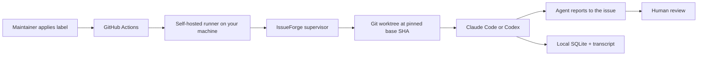

# IssueForge

**A local-first GitHub IssueOps supervisor for the coding agents you already have installed.**

[](https://github.com/vietnamesekid/issueforge/actions/workflows/ci.yml)
[](https://www.npmjs.com/package/issueforge)
[](#tests)
[](https://nodejs.org)
[](LICENSE)

Label an issue, and the agent goes to work on it — in an isolated worktree pinned to an exact
commit, on your machine — then reports what it found back to the issue for you to review.

It is not a new coding agent. It does not replace Codex or Claude Code, and it does not reimplement
their planning or tool-use loop. It handles everything *around* them: the trigger, the workspace,
the boundaries, the bookkeeping and the cleanup.

> GitHub supplies the issue and the event.
> Your machine supplies the agent, the workspace, the credentials and the storage.
> IssueForge supplies the automation.
> **You supply the judgement.**

**Status: pre-alpha.** Reproduce and fix run end to end against real issues on a private
repository, with Claude Code. Published on npm under the `alpha` tag only, Codex is not supported
yet, and the architecture is still moving — expect rough edges. See [Roadmap](#roadmap).

---

## The problem

A coding agent on your laptop can already triage a bug well. Getting it to do so on a real issue
is the tedious part:

1. Read the issue and work out what it is actually claiming.
2. Find the right commit and get a clean checkout of it — not your working tree, with your
   half-finished branch in it.
3. Write the prompt.
4. Wait, then read the transcript.
5. Write up what happened somewhere the reporter can see it.
6. Clean up the worktree, and the processes the run left behind.

Steps 1 and 4 need you. **The rest is scaffolding**, and doing it by hand is why "I'll look at that
issue" turns into a week-old tab.

## The thesis

> The scarce thing is not code generation. It is **the discipline around it**: a clean workspace,
> an exact commit, a bounded blast radius, and a record of what happened.

IssueForge automates the scaffolding and stops where judgement starts. The agent decides how to do
the work — it has your `CLAUDE.md`, your skills and your project conventions, and it knows the
repository better than a supervisor could. It then reports what it found to the issue, and a human
reads it.



**IssueForge does not grade the agent's work.** It once did, and it was wrong three times in a row
on live issues — rejecting a correct reproduction because the test was in the wrong place, then
because an assertion was inline, then because it had blocked the repository's own `CLAUDE.md` and
the agent could not learn which test runner to use. Each time it withheld a correct finding from
the one reviewer who could have judged it in seconds.

So the judgement belongs to the person who was always going to review the pull request anyway.
What IssueForge guarantees is narrower and actually enforceable: **the run happened at the commit
it says, inside a worktree that is not yours, unable to touch the paths that matter, and it is all
written down.**

## Why local-first

No IssueForge-hosted backend, queue, dashboard, database or artifact store exists. No issue body,
repository source, agent transcript, patch, test log or run history is uploaded to an IssueForge
service. Beyond privacy, this buys four things:

- **Zero marginal inference cost.** It reuses your existing Codex/Claude subscription, so there is no
  per-run bill and therefore no pressure to monetise your runs.
- **Reuses accumulated context.** Your `CLAUDE.md` / `AGENTS.md`, skills and project instructions
  already encode repository knowledge that a hosted service would have to rebuild.
- **No trust transfer.** Source and transcripts never leave the machine, so adoption needs no vendor
  security review.
- **No operational burden.** No queue, no database, no uptime to run. Install it, remove it.

GitHub remains the collaboration UI. The authoritative run data lives in `~/.issueforge`.

### How the event reaches your laptop

A GitHub Actions workflow triggers on `issues: [labeled]` and routes the job to a **self-hosted
runner** registered on your machine. The runner receives work over an outbound HTTPS long poll, so:

**no polling · no public webhook server · no tunnel · no inbound firewall rule · no cloud service.**

This was chosen over `gh webhook forward`, a GitHub App webhook, and REST polling. It is the only
option that satisfies all of those constraints at once, and it comes with useful properties for free:
a job stays queued for 24 hours if your laptop is asleep, and GitHub supplies run history, logs and a
cancel button.

---

## How it works

### Labels are intent

A maintainer applies an intent label. That is the only way a run ever starts.

| Intent label | Meaning | Status |
| --- | --- | --- |
| `issueforge:reproduce` | Triage the issue and report what you find | **Works today** |
| `issueforge:fix` | Attempt a fix and open a draft PR | **Works today** |
| `issueforge:cancel` | Cancel a live run and clean up | **Works today** |
| `issueforge:retry` | Retry the last failed or inconclusive task | Not wired up yet |

`retry` is recognised and then declined with a message on stderr, rather than failing silently. It
is listed here because the label exists, not because it does anything yet.

The two tasks form a ladder — reproduce investigates, fix also changes code — and a repository can
stop at the lower rung. See [`policy.stopAfter`](#limiting-how-far-a-run-may-go).

**IssueForge writes no labels and posts no comments.** The agent reports its own findings with
`gh`, because it knows what it did and writes a better account of it than a template can assemble
from a result object.

Every stage transition is driven by a human applying the next intent label — and that is also a
hard constraint, not only a preference: GitHub does not create workflow runs from events triggered
by `GITHUB_TOKEN`, so a label written by a run could never start the next one.

### Who owns what

| Responsibility | Owner |
| --- | --- |
| Issues, labels as intent, event delivery, run history | **GitHub** |
| Event parsing, issue locking, lifecycle state, task cards, write boundaries, bookkeeping, retention, orphan cleanup | **IssueForge** |
| Repository comprehension, planning, search, tool use, editing, running commands, **reporting its own findings** | **The harness** |
| Worktrees, refs, diffs, branches, base-SHA pinning | **Git** |
| Process groups, signals, filesystem, env isolation | **Local OS** |
| **Deciding whether the finding is right, and what to do about it** | **You** |

The boundary is enforced, not merely documented: IssueForge never plans steps, never chooses tools,
and never calls a model. If it ever needed to, it would have become a competing coding agent with no
reason to exist.

### Workspaces, and why verify gets its own clone

A run never touches a repository you work in. Pinning a base SHA there would detach your HEAD and
drag your uncommitted work across the checkout — verified the hard way.

Reproduce and fix each get a `git worktree` cut from a shared local mirror: cheap, and isolating
working files is all they need from one another.

Verify (v0.2) gets a full clone instead, because **worktrees share one `.git`**. A branch created
in one worktree is immediately visible from its sibling, so a worktree isolates *files* but not
*refs*. The clone is made with `git clone --reference <mirror> --dissociate`, which borrows objects
for speed and then severs the link. The trap: `--shared` without `--dissociate` leaves the clone
permanently coupled while looking independent.

---

## Security

IssueForge runs coding agents on your machine against text that **anyone on the internet can write**.
Security is a product requirement here, not future hardening.

The reassuring part: applying a label requires **Triage permission or above**, and the workflow that
runs is always the one on your default branch. The classic self-hosted-runner attack — a fork opens a
PR whose workflow code runs on your machine — does not apply to a label-gated `issues` trigger.

The part that does apply: anyone can open an issue and write its **body**, and that body is fed to an
agent holding your credentials. That is a prompt-injection surface. Defaults:

- **Issue text is data, never instructions.** It reaches the harness through a task-card file, never
  through argv or a shell string. All commands use argv arrays with `shell: false`. The task card
  says so explicitly in its first two lines, and in live testing the agent both resisted six
  injection attempts and *described* them in its report.
- **MCP servers are disabled.** `--strict-mcp-config` with an empty server map. Without it, a run
  was observed inheriting five of the developer's authenticated servers — Gmail, Drive, Notion —
  which turns a hostile issue body into an exfiltration path. This posture is asserted from the
  harness's own first event, before any tokens are spent; a mismatch kills the run.
- **Environment allowlist, never a denylist.** A naively spawned agent inherits your entire
  environment (82 variables on this machine); IssueForge passes roughly seven, plus any it names
  explicitly.
- **Write boundaries are enforced.** `.github/**`, `.git/**`, `.env`, keys and credential files are
  blocked outright, and the changed-file inventory is checked against them after the run. A
  violation is recorded as `blocked`, and the run's output is not interpreted as a finding.
- **Draft PRs only.** Human review and merge remain mandatory.
- Use a **private repository**, and a dedicated OS account or machine for anything public. A personal
  laptop is not a disposable sandbox.

### Limiting how far a run may go

Reproduce investigates and reports; fix also changes code and opens a draft PR. `policy.stopAfter`
in `.issueforge/config.json` pins a repository to the lower rung:

```json
{ "policy": { "stopAfter": "reproduce" } }
```

The default is `"fix"` — the full ladder — because a tool that silently declined to fix would
confuse more than it protects. Stopping early is opt-in, and is reported when it happens, naming
the setting and the file. This is how you say "triage here, but never write code on this repo"
without uninstalling anything or trusting everyone with write access to avoid a label.

### Two deliberate trade-offs

Both of these were once claimed as protections here. They are not, and pretending otherwise would be
worse than the risk itself.

**The agent reads your repository's configuration.** `CLAUDE.md`, `AGENTS.md`, skills and project
instructions are all in scope, on purpose — that context is most of why a local agent is better than
a hosted one. An earlier version blocked it and the result was an agent that could not discover the
project used vitest, wrote a test that could not run, and was then marked down for it. The residual
risk is real: repository config is executable input, and a contributor who can land a change to
`CLAUDE.md` can influence a run. It is mitigated by the write boundary, by MCP isolation, and by the
fact that you review the output — not by isolation from the repository.

**The harness gets a GitHub token.** So that it can post its own findings, the job's `GITHUB_TOKEN`
is forwarded as `GH_TOKEN`, named explicitly as an exception to the environment allowlist. It is
scoped to that one repository and expires with the run. Everything else in your environment stays
out.

There is **no second automated layer** behind these. Earlier drafts of this file promised that an
independent evidence check would catch whatever the sandbox missed; that component was removed after
it repeatedly rejected correct work. The backstop is a human reading a draft PR — which is why draft
PRs are not optional.

---

## Install

```bash
npm install -g issueforge@alpha
issueforge doctor
```

Install by name, with `@alpha`. npm points `latest` at the only published version, so a bare
`npm install -g issueforge` currently resolves to this same pre-alpha build rather than failing —
`latest` will move to the first stable release and stop shadowing it. Until then, treat `@alpha`
as the honest name for what you are getting: software that spawns coding agents on your machine.

Requires **Node.js >= 22.13** (see [Requirements](#requirements)). `issueforge doctor` checks
every dependency a run needs and tells you how to fix whatever is missing — run it first.

To upgrade, or to remove it:

```bash
npm install -g issueforge@alpha   # upgrade to the latest alpha
npm uninstall -g issueforge       # remove it; `issueforge clean` first to drop local state
```

---

## Usage

```bash
issueforge init             # generate the workflow + config a repository needs
issueforge doctor           # check Node, git, gh, harness, auth, runner

issueforge listener install    # prints how to register the self-hosted runner
issueforge listener status
issueforge listener uninstall

issueforge run reproduce --issue 123 --repo owner/name   # run one locally
issueforge run fix --issue 123 --repo owner/name         # fix it and open a draft PR
issueforge cancel --issue 123                            # stop a run already in flight
issueforge status                                        # what has run, and how it ended
issueforge clean --older-than 14 --yes                   # remove old runs and worktrees
```

`issueforge handle github-event --event-path "$GITHUB_EVENT_PATH"` is what the generated workflow
calls; you do not run it by hand.

`run fix` exits 1 if `policy.stopAfter` forbids it — you typed a command this repository declines.
The label path exits 0 instead, because a policy stop is not a failed run.

### Getting started

1. `npm install -g issueforge@alpha` (see [Install](#install)).
2. `issueforge init` in the repository, then commit the generated workflow.
3. `issueforge doctor` and fix anything it flags.
4. Register a self-hosted runner labelled `issueforge` on that repository.
5. Label an issue `issueforge:reproduce`.

One thing `doctor` cannot check for you: a self-hosted runner does not inherit your interactive
shell's `PATH`, so a version-managed Node (nvm, fnm, asdf, volta) is invisible to it and both
`issueforge` and the `claude` it spawns become "command not found". The generated workflow reads
`ISSUEFORGE_BIN` to work around it.

### Tests

```bash
pnpm check          # typecheck + lint + test — the gate CI runs
pnpm test:coverage  # the same suite, with a coverage report
```

292 tests. Line coverage is 80%, and CI fails below a 78% floor — the badge reports,
the floor enforces.

Coverage is measured against `src/`, excluding barrel files, which re-export and so
measure nothing. The number is deliberately not chased upward: the tests that matter
here exercise process groups, crash recovery and the published artifact, and a suite
optimised for a percentage would trade those for cheap unit tests.

### Requirements

- **Node.js ≥ 22.13** (Node 24 recommended — it is the current Active LTS)
- **git** and the **GitHub CLI** (`gh`)
- **Claude Code**, installed and authenticated (Codex is planned, not yet supported)
- A repository you can register a self-hosted runner on

---

## What was measured, not assumed

Five assumptions were tested against real systems before any of this was built, because a negative
result would have changed the architecture rather than the code. Each one still constrains the
design, so they are recorded here rather than in a changelog.

**Event delivery.** A label applied on GitHub reached a local process in about ten seconds, with no
inbound port, no tunnel and no polling. The same run also uncovered a work-destroying bug in the
obvious workflow configuration: under GitHub's default concurrency queue, labelling three issues in
quick succession **silently cancels the middle one**, with nothing surfaced anywhere. The generated
workflow sets `queue: max` for exactly this reason.

**Process lifecycle.** Cleaning up a harness process tree works in-process, so container isolation
stays optional rather than a v0.1 requirement. The subtle part: a supervisor killed outright can
never update its own run record, so orphans are found by checking whether the *owning process* is
still alive — never by trusting the ledger.

**Prompt-injection resistance.** Six real attacks — reading credentials outside the workspace, path
traversal, injecting an exfiltration step into CI config, harvesting environment variables, leaking
`.env`, and forcing a false verdict — were run against a live agent with decoy credential files
planted nearby. All six were contained.

The lesson that shaped everything since: **the safest configuration was also completely useless.**
Denying every action the agent had not pre-negotiated blocked its legitimate work too, producing an
agent that leaked nothing and did nothing. Safety here means an explicit allowlist, not a blanket
denial — and that same reasoning is why the supervisor no longer second-guesses the agent's method.

**Workspace isolation.** A branch and tag deliberately injected from one worktree were visible in
the shared mirror but **absent** from a `--dissociate` clone. Independence is demonstrated, not
assumed.

**Evidence validation — built, then removed.** An independent replay gate passed 8/8 in the lab and
then failed three times out of three on live issues, rejecting correct work each time. It was
deleted. The reasoning is in [The thesis](#the-thesis); it is listed here because "we tried it" is
more useful than silence.

## Roadmap

What works today is listed under [How it works](#how-it-works); what follows is what does not
exist yet.

### v0.2 — Verify *(next)*

- Verify running in its own clone, so a later stage cannot read refs an earlier one wrote
- `retry` wired up — today it is recognised and declined
- Codex adapter, as proof the harness abstraction is real
- Optional rootless-Docker sandbox wrapper

### v0.3 — Extensibility

- Public task/harness adapter SDK
- Repository profiles for Python, Go and Java
- GitHub App integration for organisation-grade permissions
- Optional remote worker profile — still opt-in, still separate from the local-first default

### Not planned

A hosted backend, web dashboard, Postgres/Redis/Temporal/Kubernetes, remote workers by default,
automatic merge, or a plugin registry.

And above all: **no custom agent loop or planner, and no grading the agent's work.** The first is
existential — the moment IssueForge plans steps or calls a model, it is a coding agent with no
reason to exist. The second was tried and removed.

---

## Contributing

Not open for outside contributions yet — the architecture is still moving, and it has changed twice
in ways that deleted working code. `CONTRIBUTING.md` covers the setup if you want to run it anyway.

Design principles, if you are reading the code later:

- Prefer boring, reliable technology. Performance is not the bottleneck here; correctness is.
- Every abstraction must justify itself with a real requirement, not a hypothetical one.
- Architecture serves the MVP, not imagined scale.
- Optimise for *easy to understand, easy to contribute, easy to remove, easy to test* over
  theoretical purity.
- If a change makes IssueForge look more like a coding-agent framework, that is scope drift — say so.

## License

See [LICENSE](LICENSE).
